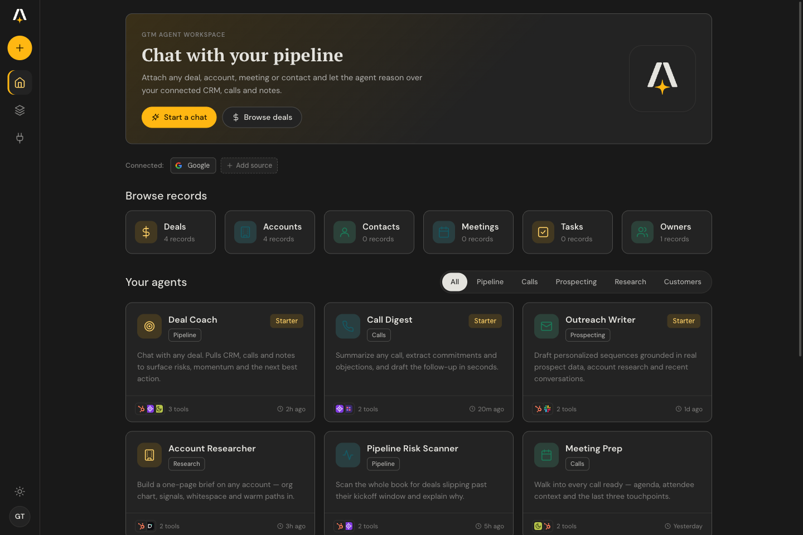
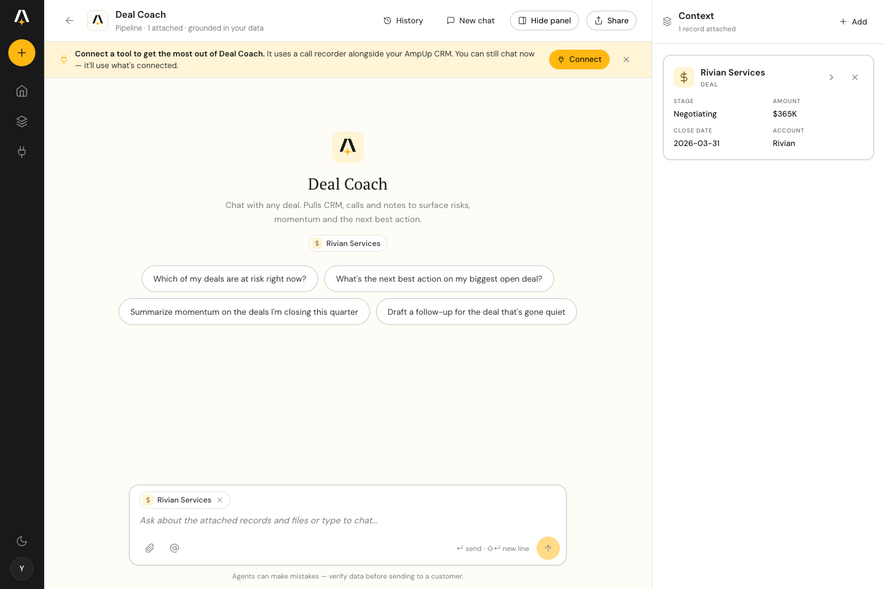
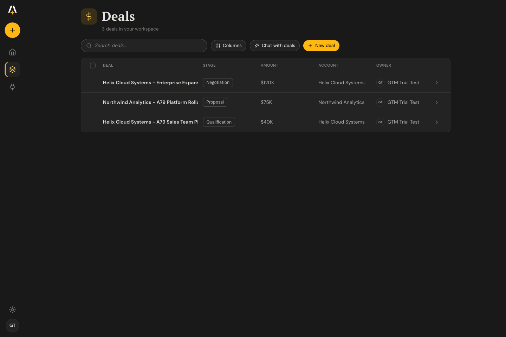
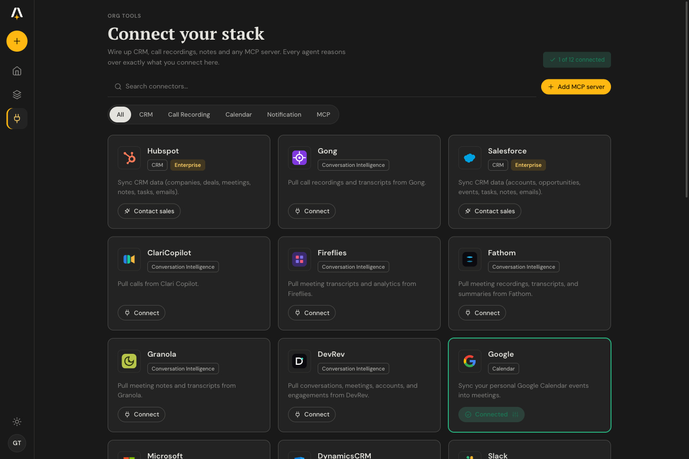
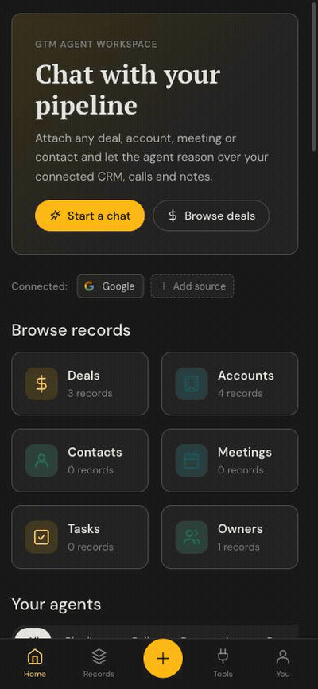

# GTM Agentic Starter Kit

**An open, self-deployable agentic chat for go-to-market teams, over your own CRM, meetings/notetaker, and knowledge base.**

Pick an agent ("Deal Coach", "Outreach Writer", "Competitive Intel"), and it works your live data: _"summarize my last call with Acme and draft the follow-up", "which renewals are at risk this quarter", "score these inbound leads against our ICP"._ Use it as a **starting point to build sales intelligence on your own data**: fork it, add your agents, and ship.

**This whole kit is open source (MIT) — fork it, self-host it, own it.** Want [Salesforce](https://www.salesforce.com), [Gong](https://www.gong.io), or [HubSpot](https://www.hubspot.com) wired up with **enterprise auth (SSO/SAML) and an SLA**? [AmpUp](https://a79.ai) can run that for you — reach out to **[support@ampup.ai](mailto:support@ampup.ai)**.

[](https://vercel.com/new/clone?repository-url=https://github.com/a79-ai/gtm-agentic-chat)
&nbsp;[](./LICENSE)
&nbsp;



---

## Who it's for

|  |  |
|---|---|
| 🚀 **Founders & GTM teams** | Deploy your own GTM copilot in one click, no infra to run. Bring an AmpUp key + an LLM key and you have agents over your real pipeline, calls, and notes. Self-hosted in **your** Vercel account, with **your** data. |
| 🛠️ **GTM Engineers** | A hackable starting point, not a black box. Agents are plain JSON, connectors are an [MCP](https://modelcontextprotocol.io) catalog, and the durable chat loop is ~one file. Fork it, add your own agents and MCP servers, and ship. |
| 📊 **Sales & Marketing Ops** | Stand up a copilot over your pipeline without waiting on eng. Connect your CRM and call recorder, point agents at your ICP and renewal data, and ship answers to the team in an afternoon. |

---

## What you get

- **10 ready-made GTM agents**, each scoped to the right tools with a tuned prompt:
  Deal Coach · Pipeline Risk Scanner · Call Digest · Meeting Prep · Outreach Writer · ICP Lead Scorer · Account Researcher · Competitive Intel · Renewal & Expansion · Customer Health Watch.
- **Connect your stack**: a catalog of **14 MCP servers** out of the box ([HubSpot](https://www.hubspot.com), [Apollo](https://www.apollo.io), [Clay](https://www.clay.com), [Explorium](https://www.explorium.ai), [Fireflies](https://fireflies.ai), [Fathom](https://fathom.video), [Granola](https://www.granola.ai), [Exa](https://exa.ai), [Tavily](https://tavily.com), [Firecrawl](https://www.firecrawl.dev), [Stripe](https://stripe.com), [Linear](https://linear.app), [Notion](https://www.notion.so), [Sentry](https://sentry.io)) plus your AmpUp CRM. Add any MCP server with [OAuth/DCR](https://datatracker.ietf.org/doc/html/rfc7591).
- **Grounded chat over your CRM**: accounts, deals, meetings, and tasks as first-class records; attach any of them as context for a turn.
- **Notetaker**: send a recorder bot to a live Meet/Zoom/Teams call right from settings.
- **Embeddable widget**: one `<script>` tag drops the chat onto any site.
- **Mobile-ready**: the same workspace and chat on a phone.
- **Durable runtime**: every turn (and tool call) is a replayable step on the [Vercel Workflow DevKit](https://workflow.dev); the stream _is_ the transcript.

|  |  |
|---|---|
|  |  |
|  |  |

## See it in action

**Deal Coach, grounded in your CRM**: pick an agent, it pulls the deal + signals and surfaces the risks and the next best action:


**Bring your own LLM key**: chat runs on your own Anthropic, OpenAI or Google key — paste it in Settings, hit **Test key** to confirm it works, and you're chatting. It's stored only in your browser; the workspace key is reserved for internal & Pro users:


**Fully responsive on mobile**: the same workspace and chat on a phone:



**Embeddable chat widget**: one `<script src="/widget.js">` tag drops the chat onto any site (Shadow-DOM launcher → chrome-less `/embed` iframe):

[▶ Watch the embed demo](./public/features/embed-chat-demo.mp4)

## Deploy

[](https://vercel.com/new/clone?repository-url=https://github.com/a79-ai/gtm-agentic-chat)

> The one-click Deploy button requires the repo to be **public**. If you're
> viewing a private fork, clone it and deploy with the [Vercel CLI](https://vercel.com/docs/cli)
> (`vercel deploy`) instead.

The default deploy is **single-org**: one AmpUp key scopes everything to your org. Set these environment variables (Vercel will prompt for the required ones):

| Variable | Required | What it is |
|---|---|---|
| `AMPUP_MCP_URL` | ✅ | Your org's MCP endpoint, e.g. `https://<org>.a79dev.com/mcp` |
| `AMPUP_MCP_API_KEY` | ✅ | Your AmpUp API key (`sk-a79-…`); scopes all data access to your org |
| `ANTHROPIC_API_KEY` | one of | Bring your own Anthropic key (calls Anthropic directly; you pay Anthropic) |
| `AI_GATEWAY_API_KEY` | one of | Use the Vercel AI Gateway instead (unified billing; needs a funded balance) |
| `CHAT_MODEL` | – | Override the model (default `claude-sonnet-4-6`, or `anthropic/claude-sonnet-4.6` on the gateway) |
| `SYSTEM_PROMPT` | – | Override the assistant's system prompt |
| `ENABLE_WEB_SEARCH` | – | `true` to enable provider-native web search (Anthropic/Google) |
| `ALLOWED_ORIGIN` | – | CORS allow-origin for the API. Unset = same-origin only (no CORS header); set a specific origin, or `*`, to allow cross-origin calls (e.g. the embed widget) |

Pick **one** LLM path. `ANTHROPIC_API_KEY` wins if both are set.

## Make it yours

This is a starter kit; the GTM-specific parts are data, not code:

- **[`config/agents.json`](./config/agents.json)**: the homepage agents. Each is `{ name, icon, tag, desc, systemPrompt, mcpServerIds, includeAmpup, starterQuestions }`. Add an entry and it shows up in the gallery; scope it to catalog slugs (or `mcpCategories`) and write its prompt.
- **[`config/mcp-catalog.json`](./config/mcp-catalog.json)**: the recommended connector catalog (14 servers). Add a server with its hosted MCP URL; the `slug` is the canonical id your agents target.
- **[`components/gtm/`](./components/gtm)**: the UI (home, connectors, records, chat). [`app/ds/`](./app/ds) is the design system (light/dark).
- **[`workflows/chat.ts`](./workflows/chat.ts)**: the durable agent loop. Tools are discovered from your MCP at runtime; no tool list is baked into the build.

## How it works

- **[`app/page.tsx`](./app/page.tsx) + [`components/gtm/`](./components/gtm)**: the GTM Agent UI: a dark left rail, Home
  (agents gallery + connected sources), Connectors, CRM entity list/detail, and the
  grounded Chat workspace (attach picker + context panel), with light/dark theme.
- **[`app/api/records/route.ts`](./app/api/records/route.ts)**: MCP-backed listing of accounts / deals /
  meetings / tasks, mapped to the entity schema the UI reads ([`lib/gtm/data.jsx`](./lib/gtm/data.jsx)).
- **[`app/api/chat/route.ts`](./app/api/chat/route.ts)**: starts one durable workflow run per conversation
  (first turn) and resumes it for follow-ups.
- **[`workflows/chat.ts`](./workflows/chat.ts)**: the durable agent loop on the [Vercel Workflow DevKit](https://workflow.dev),
  so each turn (and each tool call) is a durable, replayable step.
- **[`lib/mcp.ts`](./lib/mcp.ts)**: connects to your `AMPUP_MCP_URL` over streamable HTTP.
  `listAmpupTools` discovers your org's tools at runtime (`tools/list`); each tool
  call is forwarded with your key. No tool list is baked into the build.
- **[`lib/model.ts`](./lib/model.ts)**: resolves the LLM from env (direct [Anthropic](https://www.anthropic.com) or [AI Gateway](https://vercel.com/docs/ai-gateway)).

## Local development

```bash
cp .env.example .env.local   # fill in AMPUP_MCP_URL, AMPUP_MCP_API_KEY, an LLM key
pnpm install
pnpm dev                     # http://localhost:3000
```

The durable workflow runtime runs locally via the [Workflow DevKit](https://workflow.dev)
(`pnpm workflow:web` for the workflow dashboard). Built with [Next.js](https://nextjs.org),
the [Vercel AI SDK](https://ai-sdk.dev), and [pnpm](https://pnpm.io).

## Quality & tests

```bash
pnpm check       # Biome lint + format (ultracite preset)
pnpm fix         # auto-fix lint + format
pnpm typecheck   # tsc --noEmit
pnpm build       # next build
pnpm test        # Playwright e2e
```

Linting and formatting use [Biome](https://biomejs.dev) (the [ultracite](https://www.ultracite.ai) preset); end-to-end tests use [Playwright](https://playwright.dev).

CI (`.github/workflows/`) runs `check` + `typecheck` + `build` on every PR, plus
the e2e suite, which covers three flows and self-gates by target:

- **chat** and **entity list-pages** run against a local single-org bench. `pnpm
  test` boots `next dev` from `.env.e2e` (copy `.env.e2e.example`: an AmpUp MCP
  URL + key for one org, overlays disabled) and drives the durable chat runtime
  and the `/records/*` lists against live data.
- **login** runs against a deployed app. Point it at the deploy and it asserts the
  Welcome CTAs hand off to Auth0 (no credentials needed):

  ```bash
  E2E_BASE_URL=https://your-app.vercel.app pnpm test
  ```

In CI the bench specs run when the `E2E_AMPUP_MCP_URL` / `E2E_AMPUP_MCP_API_KEY` /
`E2E_AI_GATEWAY_API_KEY` secrets are set, and the login smoke runs when the
`E2E_DEPLOY_URL` repo variable points at your deployment (both skip cleanly when
unset).

## Multi-tenant mode (advanced)

The default is one org per deployment (the env key scopes everything). The template
also ships a **multi-tenant** path: with `MULTI_TENANT=true` + [Auth0](https://auth0.com) configured,
each visitor logs in, mints a **per-user** AmpUp key, and sees only their own data,
with no shared env key fallback. This is how the hosted version at
[chat.ampup.ai](https://chat.ampup.ai) runs. It needs an Auth0 tenant and an AmpUp
org that issues per-user session keys; see `lib/gtm/auth.jsx` for the backbone.

## Notes / limits

- **Cold starts (observed, cause unconfirmed).** Right after a deploy, a request
  occasionally truncated before the agent finished; retrying succeeded, and
  steady-state requests were reliable. If you see a turn cut short, retry.
- Conversation history lives in the durable run (the stream *is* the transcript).
  In multi-tenant mode, conversations are persisted per-user via AmpUp and the
  cold-reopen replay at `/api/conversation/[runId]` is gated behind the per-user key.

## How it compares

Tools like [**Lightfield**](https://lightfield.app) and [**Monaco**](https://www.monaco.com) are polished, SaaS-only platforms that *replace* your CRM and host your data in their cloud. This kit takes the opposite bet: open source, deployed to **your** Vercel, running agents **over the CRM and tools you already own**. The full breakdown, with honest trade-offs, is in **[COMPARISON.md](./COMPARISON.md)**.

> **Open source, with a managed path when you need it.** Everything here is MIT-licensed and yours to self-host. If you'd rather not run it yourself — or you need [Salesforce](https://www.salesforce.com), [Gong](https://www.gong.io), or [HubSpot](https://www.hubspot.com) connected with **enterprise auth (SSO/SAML)** and a **support SLA** — [AmpUp](https://a79.ai) offers that as a managed service. Reach out to **[support@ampup.ai](mailto:support@ampup.ai)**.

## Privacy, security & license

- **[PRIVACY.md](./PRIVACY.md)**: exactly where your data goes. This is a
  self-hosted client: it runs in **your** Vercel account with **your**
  credentials, and the template authors receive none of your data. Your chat data
  flows only to your chosen LLM provider (Anthropic or the Vercel AI Gateway) and
  to your AmpUp MCP endpoint; there is no telemetry and no transcript database.
- **[SECURITY.md](./SECURITY.md)**: how to report a vulnerability
  (`security@a79.ai`) and an operator hardening checklist (set
  `AUTH_SESSION_SECRET` / `OAUTH_STATE_SECRET`, use `MULTI_TENANT=true` for more
  than one user).
- **License:** [MIT](./LICENSE).